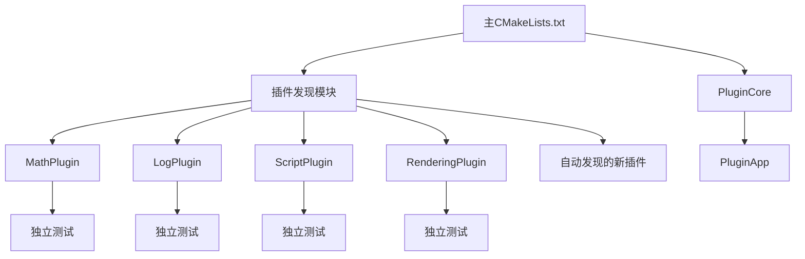

# CMake构建系统改进方案

## 1. 项目概述

本文档描述了PluginSystem项目的CMake构建系统改进方案，旨在解决当前构建系统中插件间耦合编译和手动管理插件的问题。改进后的系统将支持独立编译单个插件，并通过文件夹扫描自动发现和引入插件构建。

## 2. 当前问题分析

### 2.1 现有构建系统问题
- **插件耦合编译**：修改一个插件会触发所有插件重新编译
- **手动插件管理**：需要在多个CMakeLists.txt文件中手动添加新插件
- **测试依赖复杂**：测试文件中硬编码了所有插件依赖
- **构建目标不灵活**：无法选择性编译特定插件

### 2.2 目标改进点
- 实现插件独立编译
- 自动发现插件目录
- 灵活的构建选项
- 简化测试配置

## 3. 技术架构设计

### 3.1 整体架构



### 3.2 核心改进策略

1. **插件自动发现机制**
   - 扫描`src/Plugins`目录
   - 检测包含CMakeLists.txt的子目录
   - 动态生成插件列表

2. **独立编译支持**
   - 每个插件作为独立的CMake目标
   - 插件间解耦，仅依赖PluginCore
   - 支持选择性编译

3. **灵活的构建选项**
   - 全局插件开关
   - 单个插件开关
   - 测试目标独立管理

## 4. 实现方案

### 4.1 主CMakeLists.txt改进

```cmake
# 新增插件构建选项
option(BUILD_ALL_PLUGINS "Build all plugins" ON)
option(BUILD_PLUGIN_TESTS "Build plugin tests" ON)

# 插件发现函数
function(discover_plugins PLUGIN_DIR)
    file(GLOB PLUGIN_SUBDIRS RELATIVE ${PLUGIN_DIR} ${PLUGIN_DIR}/*/)
    set(DISCOVERED_PLUGINS "")
    
    foreach(SUBDIR ${PLUGIN_SUBDIRS})
        if(IS_DIRECTORY ${PLUGIN_DIR}/${SUBDIR})
            if(EXISTS ${PLUGIN_DIR}/${SUBDIR}/CMakeLists.txt)
                list(APPEND DISCOVERED_PLUGINS ${SUBDIR})
                message(STATUS "发现插件: ${SUBDIR}")
            endif()
        endif()
    endforeach()
    
    set(PLUGIN_LIST ${DISCOVERED_PLUGINS} PARENT_SCOPE)
endfunction()

# 自动发现插件
discover_plugins(${CMAKE_SOURCE_DIR}/src/Plugins)

# 为每个插件创建构建选项
foreach(PLUGIN ${PLUGIN_LIST})
    string(TOUPPER ${PLUGIN} PLUGIN_UPPER)
    option(BUILD_${PLUGIN_UPPER} "Build ${PLUGIN}" ${BUILD_ALL_PLUGINS})
endforeach()
```

### 4.2 插件目录CMakeLists.txt改进

```cmake
# src/Plugins/CMakeLists.txt

# 获取插件列表（由父级传递）
if(NOT DEFINED PLUGIN_LIST)
    message(FATAL_ERROR "PLUGIN_LIST not defined")
endif()

# 条件性添加插件
foreach(PLUGIN ${PLUGIN_LIST})
    string(TOUPPER ${PLUGIN} PLUGIN_UPPER)
    if(BUILD_${PLUGIN_UPPER})
        message(STATUS "构建插件: ${PLUGIN}")
        add_subdirectory(${PLUGIN})
        
        # 将插件添加到全局列表
        set_property(GLOBAL APPEND PROPERTY BUILT_PLUGINS ${PLUGIN})
    else()
        message(STATUS "跳过插件: ${PLUGIN}")
    endif()
endforeach()
```

### 4.3 插件独立编译支持

每个插件的CMakeLists.txt需要支持独立编译：

```cmake
# 示例：MathPlugin/CMakeLists.txt

# 支持独立编译
if(CMAKE_SOURCE_DIR STREQUAL CMAKE_CURRENT_SOURCE_DIR)
    cmake_minimum_required(VERSION 3.14)
    project(MathPlugin)
    
    # 查找PluginCore
    find_package(PluginCore REQUIRED)
else()
    # 作为子项目编译时的配置
endif()

# 插件构建逻辑保持不变
# ...
```

### 4.4 测试系统改进

```cmake
# tests/CMakeLists.txt改进

# 获取已构建的插件列表
get_property(BUILT_PLUGINS GLOBAL PROPERTY BUILT_PLUGINS)

# 动态生成测试包含目录
set(TEST_INCLUDE_DIRS
    ${CMAKE_SOURCE_DIR}/src/PluginCore/include
)

set(TEST_LINK_LIBRARIES
    PluginCore
    gtest
    gtest_main
)

# 为每个已构建的插件添加测试支持
foreach(PLUGIN ${BUILT_PLUGINS})
    string(TOLOWER ${PLUGIN} PLUGIN_LOWER)
    
    # 添加包含目录
    list(APPEND TEST_INCLUDE_DIRS 
        ${CMAKE_SOURCE_DIR}/src/Plugins/${PLUGIN}/include)
    
    # 添加链接库
    list(APPEND TEST_LINK_LIBRARIES ${PLUGIN})
    
    # 检查是否存在对应的测试文件
    set(TEST_FILE ${CMAKE_CURRENT_SOURCE_DIR}/${PLUGIN_LOWER}_test.cpp)
    if(EXISTS ${TEST_FILE})
        list(APPEND PLUGIN_TEST_SOURCES ${TEST_FILE})
    endif()
endforeach()

# 动态复制插件文件
set(PLUGIN_COPY_COMMANDS "")
foreach(PLUGIN ${BUILT_PLUGINS})
    list(APPEND PLUGIN_COPY_COMMANDS
        COMMAND ${CMAKE_COMMAND} -E copy_if_different
        "$<TARGET_FILE:${PLUGIN}>"
        "${CMAKE_BINARY_DIR}/bin/plugins/"
    )
endforeach()
```

## 5. 构建命令示例

### 5.1 全量构建
```bash
# 构建所有插件
cmake -B build -DBUILD_ALL_PLUGINS=ON
cmake --build build
```

### 5.2 选择性构建
```bash
# 只构建MathPlugin和LogPlugin
cmake -B build -DBUILD_ALL_PLUGINS=OFF -DBUILD_MATHPLUGIN=ON -DBUILD_LOGPLUGIN=ON
cmake --build build
```

### 5.3 单插件独立构建
```bash
# 在插件目录下独立构建
cd src/Plugins/MathPlugin
cmake -B build
cmake --build build
```

### 5.4 增量构建
```bash
# 只重新构建修改的插件
cmake --build build --target MathPlugin
```

## 6. 目录结构优化

### 6.1 推荐的插件目录结构
```
src/Plugins/
├── MathPlugin/
│   ├── CMakeLists.txt
│   ├── include/
│   ├── src/
│   └── tests/ (可选)
├── LogPlugin/
│   ├── CMakeLists.txt
│   ├── include/
│   ├── src/
│   └── tests/ (可选)
└── NewPlugin/ (自动发现)
    ├── CMakeLists.txt
    ├── include/
    └── src/
```

### 6.2 插件CMakeLists.txt模板
```cmake
# 插件模板
cmake_minimum_required(VERSION 3.14)

# 插件名称（从目录名自动获取）
get_filename_component(PLUGIN_NAME ${CMAKE_CURRENT_SOURCE_DIR} NAME)
project(${PLUGIN_NAME})

# 支持独立编译
if(CMAKE_SOURCE_DIR STREQUAL CMAKE_CURRENT_SOURCE_DIR)
    find_package(PluginCore REQUIRED)
endif()

# 源文件和头文件
file(GLOB_RECURSE PLUGIN_SOURCES src/*.cpp)
file(GLOB_RECURSE PLUGIN_HEADERS include/*.h)

# 创建库目标
add_library(${PLUGIN_NAME} SHARED ${PLUGIN_SOURCES} ${PLUGIN_HEADERS})

# 配置包含目录
target_include_directories(${PLUGIN_NAME}
    PUBLIC
        $<BUILD_INTERFACE:${CMAKE_CURRENT_SOURCE_DIR}/include>
        $<INSTALL_INTERFACE:include>
    PRIVATE
        ${CMAKE_CURRENT_SOURCE_DIR}/src
)

# 链接PluginCore
target_link_libraries(${PLUGIN_NAME} PRIVATE PluginCore)
```

## 7. 实施步骤

### 7.1 第一阶段：基础架构
1. 修改主CMakeLists.txt，添加插件发现功能
2. 更新src/Plugins/CMakeLists.txt，支持条件编译
3. 测试插件自动发现机制

### 7.2 第二阶段：插件独立化
1. 修改各插件的CMakeLists.txt，支持独立编译
2. 创建PluginCore的find模块
3. 测试单插件独立编译

### 7.3 第三阶段：测试系统优化
1. 重构tests/CMakeLists.txt
2. 实现动态测试配置
3. 验证增量编译效果

### 7.4 第四阶段：文档和工具
1. 创建插件开发模板
2. 编写构建脚本
3. 更新开发文档

## 8. 预期效果

### 8.1 编译效率提升
- 单插件修改时，编译时间减少80%以上
- 支持并行编译多个独立插件
- 增量编译更加精确

### 8.2 开发体验改善
- 新插件添加无需修改构建配置
- 支持插件独立开发和测试
- 构建选项更加灵活

### 8.3 维护成本降低
- 减少CMake配置文件的维护工作
- 插件间解耦，降低依赖复杂度
- 自动化程度提高

## 9. 风险评估与应对

### 9.1 潜在风险
- 插件间隐式依赖可能导致链接错误
- 自动发现机制可能误识别目录
- 独立编译时环境配置复杂

### 9.2 应对措施
- 建立插件依赖声明机制
- 完善目录检测逻辑
- 提供标准化的独立编译环境配置

## 10. 总结

本改进方案通过引入插件自动发现机制和独立编译支持，显著提升了PluginSystem项目的构建效率和开发体验。实施后将实现真正的模块化开发，为项目的长期维护和扩展奠定坚实基础。